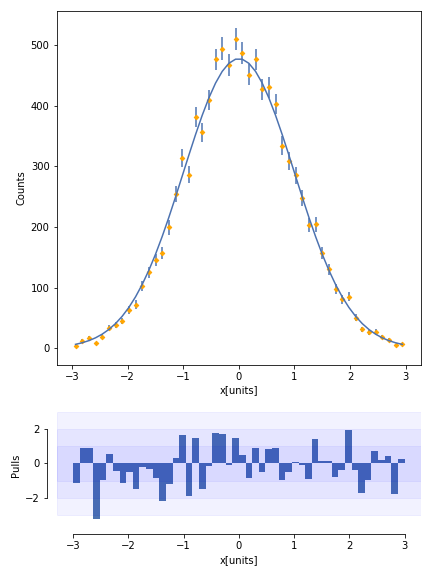

# GSoC Hist Plotting

## Introduction

Python bindings for Boost::Histogram (source), a C++14 library. This should become one of the fastest libraries for histogramming, while still providing the power of a full histogram object. 
This project is aimed at adding a couple of new features to the project and also add a Pull plot method to the NamedHist class. 

## Axis Naming

Before this project was undertaken the following code had to be executed in order to define and fill a Histogram consisting of objects. 

```python
# Data generation

import numpy as np

# Random numbers from -1 to 1
x,y = np.random.random_sample([2, 1_000_000])*2 - 1

# Only hits inside radius 1 are "valid"
valid = (x**2 + y**2) < 1
```

```python
# Pure boost-histogram
import boost_histogram as bh

h = bh.Histogram(
    bh.axis.Regular(10, -1, 1, metadata={'name':'x'}),
    bh.axis.Regular(10, -1, 1, metadata={'name':'y'}),
    bh.axis.Integer(0, 2, underflow=False, overflow=False, metadata={'name':'valid'}),
)

h.fill(x, y, valid)

valid_only = h[:, :, bh.loc(True)] # Passing True directly happens to work here as well
valid_only = h[{2:bh.loc(True)}]   # Alternate way to do the same thing ### BROKEN in 0.6.2

valid_and_invalid = h[:, :, ::bh.sum]                 # All (valid and invalid)
valid_and_invalid = h[{2:slice(None, None, bh.sum)}]   # Alternate way to do the same thing

```

But however now while defining a axis object we can assign it a name and then use that to call and fill it in the future as shown below. 

```python
# Hypothetical Hist

from hist import NamedHist, axis

h = NamedHist(
    axis.Regular(10, -1, 1, name="x"),
    axis.Regular(10, -1, 1, name="y"),
    axis.bool(name="valid"),
)

h.fill(x=x, y=y, valid=valid)

valid_and_invalid = h[{"valid": slice(None, None, bh.sum)}]
```

This makes the defining, filling and usage of the different Histogram and axes objects extremely easy and flexible at the same time. 

NOTE: The previous methods of defining, filling and indexing have been preserved for all those who prefer those methods. 


## Pull Plotting

Histograms in HEP often use pull plots ([like this
one](https://cds.cern.ch/record/1969801/files/Figure2a.png)). Hence it becomes extremely crucial to have pull plotting methods such as the one defined within the NamedHist object that uses a single axis along with its pdf and plots its pull. Here is a sample code that would be used to plot a pull plot. 

```python
from hist import NamedHist, axis

data = np.random.normal(size=10_000)
h = NamedHist(
    axis.Regular(50, -3, 3, title="data [units]"),
)
h.fill(data)

def pdf(x):
    return 1/np.sqrt(2*np.pi) * np.exp(-.5*x**2)

ax1, ax2 = h.pull_plot(pdf)

```

The following would be the graph that would be plotted. 





## Improvements

Now obviously this wqas a project that was undertaken for a short period of time and hence there is a massive room for improvement. I have listed out some of those which could be implemented in the coming versions:

* The fill function of the NamedHist uses a list in order to correspondingly rearange the given keyword arguments. But however this isn't exactly very efficient and since this is a project undertaken solely for the purpose of speed, the given function has to be modified to not just increase speed but also to decrease memory consumption. 
* The same could be said about __getitem__() function which again may or may not employ a list in order to assit it to convert the user input into a format suitable to be fed into the super().__getitem__() function. 
* The pull plot method currently can only plot those Histograms with only one axis object and hence some kind of extension has to be undertaken with it in order for it to be able to deal with multi dimensional pull plots. One workaround to this solution could be to plot the perspective in which the count is the y axis. Now the angle of viewing for this perspective should be such that that the loss in information is minimal, and hence methods such as PCA could be deployed for the same. 

## Additional Notes

* Multiple versions of the source file had to be built before the final one was ready, please use the latest version (1.0 at the time of writing) in order to test any of the functions that have been written. 
* The version was set from within the setup.py file instead of using the __version__. 
